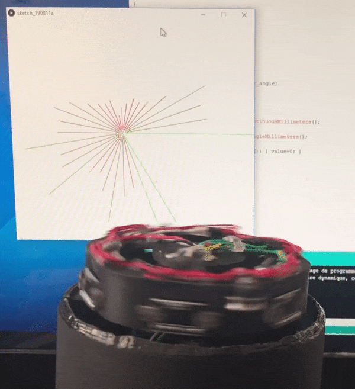

# VL53L0X based lidar

This repository contains the source code and 3D files of a lidar based on 6 VL530X sensors an a brushless motor.

# Parts

- 3D printed parts from Lidar.step
- 6 VL53L0X sensors [here](https://fr.aliexpress.com/item/32908633788.html)
- 1 brushless motor [FlyCat 2805/140KV](https://fr.aliexpress.com/item/32890233517.html)
- 1 double H bridge L298N [here](https://fr.aliexpress.com/item/32994608743.html)

# Repository

- **Lidar.step** 3D file of the full assembly
- **lidar/lidar.ino** Arduino source code (with other C++ classes next to it) 
- **lidar/ui_processing** Small UI source code to preview lidar measures using [Processing](https://processing.org/download/)
